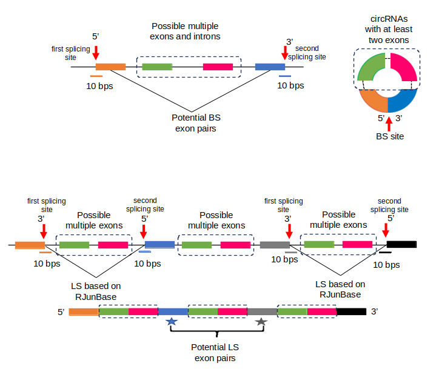
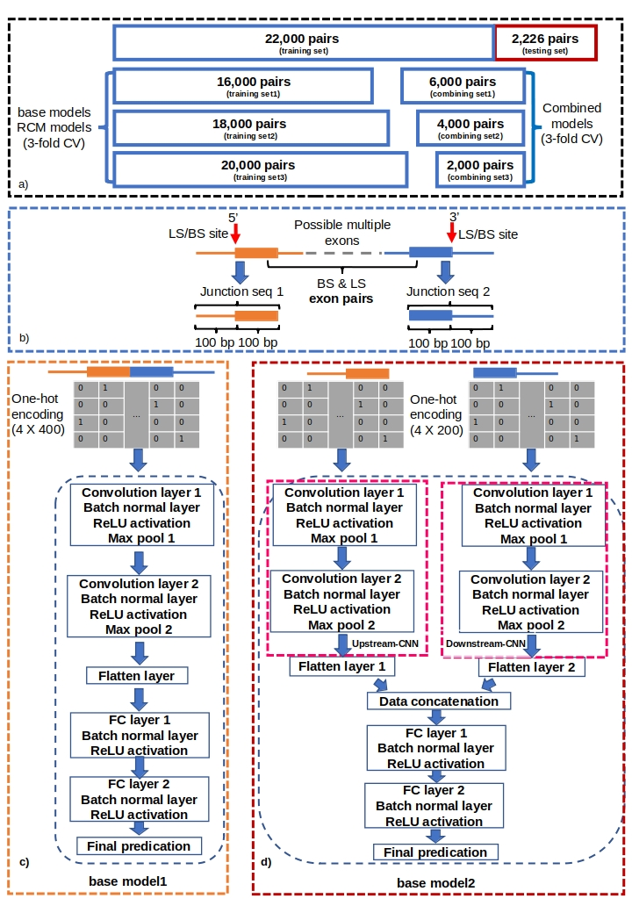
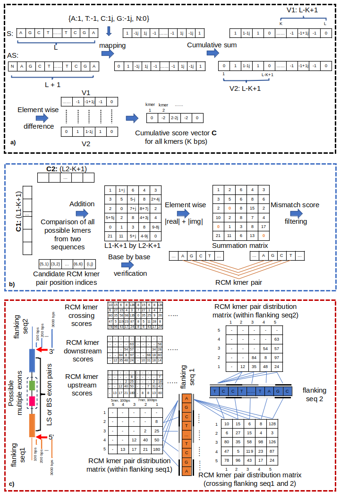

"CircCNNs, a convolutional neural network framework to better understand the biogenesis of exonic circRNAs"

# Organization of this Repository

## The Data folder:
contains the genomic coordinates of all the back-splicing (BS), linear-splicing (LS) exon pairs used in this study. Due to the file size limitation in GitHub, the remaining dataset can be downloaded from https://drive.google.com/drive/folders/1wq6vJ83Bjy9g0zlWZklpU-hEx1xHWhDG.

### The Model_Codes folder:
contains the model specifications and training process for the base, RCM as well as Combined model structures. It also contains the retraining code to retrain the base, RCM as well as Combined models. 

### The Auxiliary_Codes folder:
contains data preparation code, model training cross-validation code, position probability matrix extraction code, fast numerical method for RCM calculation code as well as a Jupyter notebook to extract the motif from the trained optimal base models.

### The Model_Evaluation folder contains:
a Jupyter notebook for model evaluation on the testing set. 

### The Trained_Model_Weights folder contains:
The trained model weights that can be used to evaluate the model performance on the testing set by using the Jupyter notebook in the Model_Evaluation folder.

The figure below shows the rationale of how we created exon pairs that either participate in back-splicing (BS) to form exonic circRNAs or linear-splicing (LS) to form linear transcript. Our CircCNNs framework is then based on this curated dataset to classify between the BS and LS exon pairs.

The figure below shows our base models processing the junction sequences to classify BS and LS exon pairs.

The figure below shows our fast numerical methods to calculate reverse complementary matches (RCMs) crossing the flanking introns or within the flanking intron.

If you find anything useful, please cite our paper.
