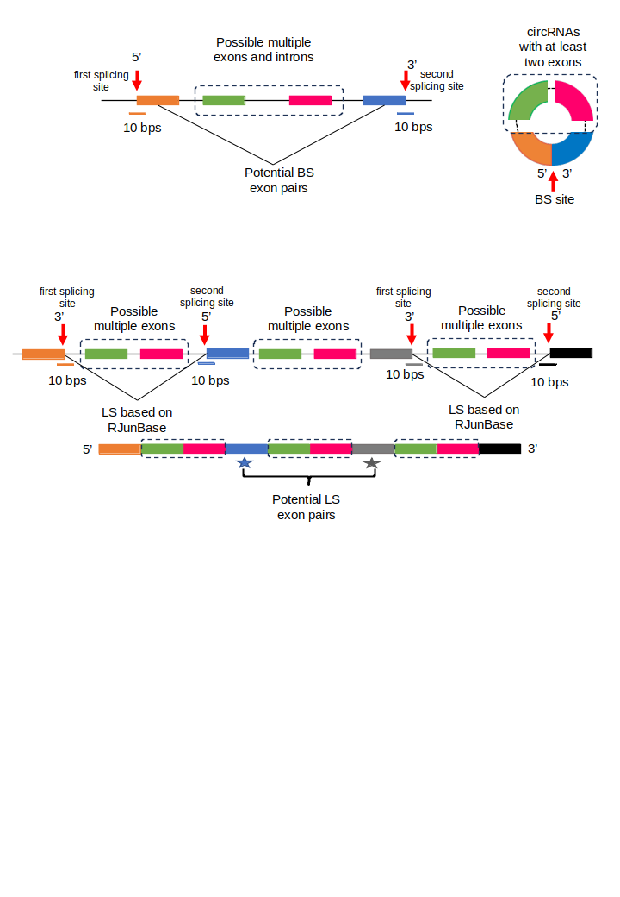

Data and code for "CircCNNs, a convolutional neural network framework to better understand the biogenesis of exonic circRNAs"

The figure below shows the ideas of exon pairs that can either participate in linear-splicing to form linear transcript or back-splicing to form exonic circRNAs.

